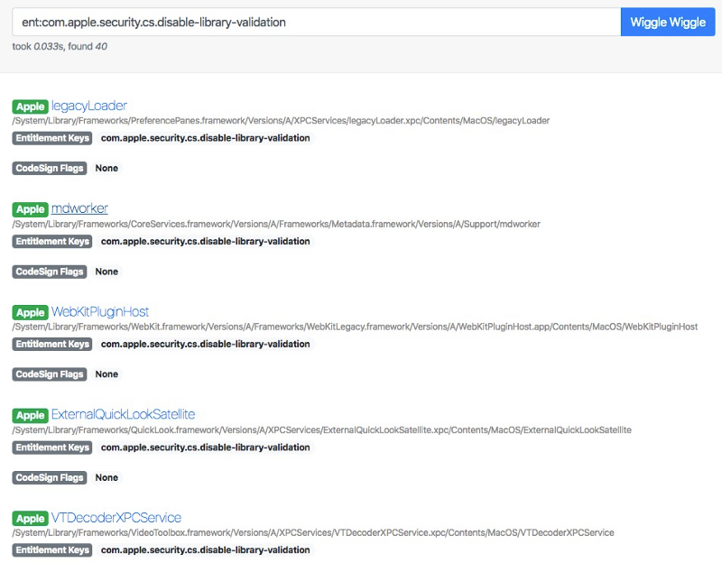
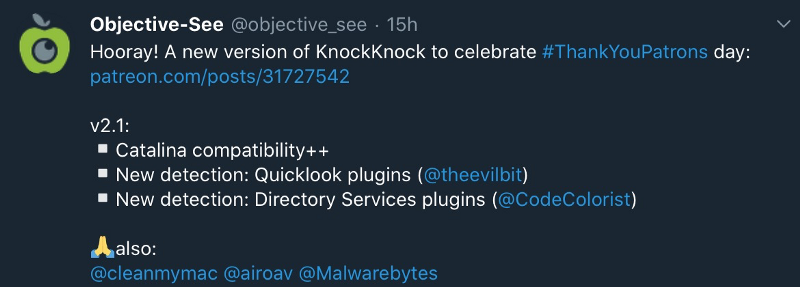
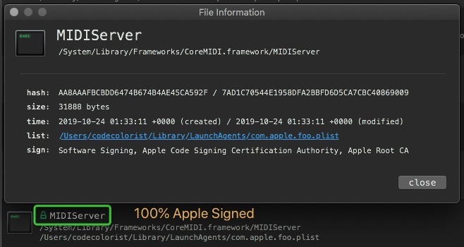

---
layout:	post
title:	"Two macOS Persistence Tricks Abusing Plugins"
date:	  2019-11-21
image:  img/2019-11-21-two-macos-persistence-tricks-abusing/plugin.jpg
desc:   Similar to DLL sideloading, legit plugins on macOS could be abused to load executable code on startup.
---

This blog does not involve any vulnerability, but I hope the readers can find these tricks useful for red teaming and malware defense.

Since Mojave (10.14), [Hardened Runtime](https://developer.apple.com/documentation/security/hardened_runtime_entitlements?language=objc) has been introduced to bring global Library Validation enforcement, which prohibits dynamic libraries without valid code signature from the same developer or Apple from being loaded.

Some entitlements can mark an executable as an exception.

`AMFI.kext!platformHardenFlags`:

```c
if (dict_has_entitlement(dict, "com.apple.security.cs.disable-library-validation") ||
    dict_has_entitlement(dict, "com.apple.private.cs.automator-plugins")) {
  flag &= 0xFFFFDFEF;
}
```

`AMFI!library_validation_failure`:

```c
    teamid = csproc_get_teamid(a1);
    is_platform_bin = csproc_get_platform_binary(a1);
    proc_name(v14, &buf, 256);
    hash = csfg_get_cdhash(*a2, a2[1], &v37);
    if ( v37 == 20 )
      v20 = hash == 0;
    else
      v20 = 1;
    if ( v20 )
      v21 = (const unsigned __int8 *)&_library_validation_failure(proc *,FileGlobInfo<false> *,bool,char const*,unsigned long long,unsigned long)::empty_cdhash;
    else
      v21 = (const unsigned __int8 *)hash;
    LOBYTE(done) = 0;
    AppleMobileFileIntegrity::AMFIEntitlementGetBool(
      a1,
      (proc *)"com.apple.private.skip-library-validation",
      (const char *)&done,
      v19);
    v22 = (unsigned __int8)done;
    if ( v21 && !(_BYTE)done )
    {
      if ( !(unsigned int)_codeDirectoryHashInCompilationServiceHash(v21) )
        goto LABEL_27;
      AppleMobileFileIntegrity::AMFIEntitlementGetBool(
        a1,
        (proc *)"com.apple.private.amfi.can-execute-cdhash",
        (const char *)&done,
        v23);
      v22 = (unsigned __int8)done;
    }
```


When an executable has any one of these entitlements, it implies that this process is designed to load third-party libraries. This leads me to these interesting persistence vectors on macOS.



## dspluginhelperd

This daemon (/usr/libexec/dspluginhelperd) is for loading 3rd-party DirectoryService plugins. It launches on each system boot, and automatically reloads after crash.

In function `CPluginHandler::LoadPlugins`, it scans bundles that match `/Library/DirectoryServices/PlugIns/*.dsplug` and execute them. Since this process has root privilege and no sandbox at all, it is a powerful place to put persistence payload. This directory requires root privilege to write. The malware must either trick user to input administrator password or exploit a privilege escalation bug.

ObjectiveSee's KnockKnock v2.1 has introduced detection for this persistence vector.



## MIDIServer

You must have impression on it because this service has just been exploited in this year's TyphoonPwn for userspace sandbox escape on iOS.

```xml
➜ ~ jtool --ent /System/Library/Frameworks/CoreMIDI.framework/MIDIServer
<?xml version="1.0" encoding="UTF-8"?>
<!DOCTYPE plist PUBLIC "-//Apple//DTD PLIST 1.0//EN" "http://www.apple.com/DTDs/PropertyList-1.0.dtd">
<plist version="1.0">
<dict>
        <key>com.apple.security.cs.disable-library-validation</key>
        <true/>
        <key>platform-application</key>
        <true/>
        <key>seatbelt-profiles</key>
        <array>
                <string>MIDIServer</string>
        </array>
</dict>
</plist>
```

It loads plugins (recursively search for child directories) from three locations:

* `/System/Library/Extensions/**/*.plugin`
* `/Library/Audio/MIDI Drivers/**/*.plugin`
* `~/Library/Audio/MIDI Drivers/**/*.plugin`

This agent does not set RunAtLoad to YES, and system built-in LaunchAgents is readonly, so we need to write a new launch agent entry in `~/Library/LaunchAgents/whatever.plist`. Since launchd also supports setting environment string in the plist, we can also use an alternative path for `HOME` directory. This vector does not require root privilege.

It can not hide itself from persistence detection softwares like KnockKnock. But after all, this executable is valid signed by Apple.



Since we've talked about the recent bug reports for MIDIServer:

* <https://blogs.projectmoon.pw/reports/MIDIServer.c>
* <https://ssd-disclosure.com/archives/4066/ssd-advisory-via-ios-jailbreak-sandbox-escape-and-kernel-r-w-leading-to-rce>

Could this be a persistence vector on iOS? Unfortunately not.

AMFI on iOS is slightly different. It does not care about `com.apple.security.cs.disable-library-validation` at all. On the other hand, Apple has introduced a new sandbox profile on iOS 13 to reduce its attack surface. But on macOS, sandbox profile named MIDIServer is nowhere to be found. Then it is like:


So this executable has one entitlement that does not work on iOS, and another one useless on macOS 😢

On 10.15.1 there are about 30+ executables possessing this entitlement. I only analyzed some of them and found these two nice example.

You may also refer to other vectors like QuickLook plugins: <https://github.com/theevilbit/macos/tree/master/PersistentQL>. Look less ideal because they are sandboxed.
