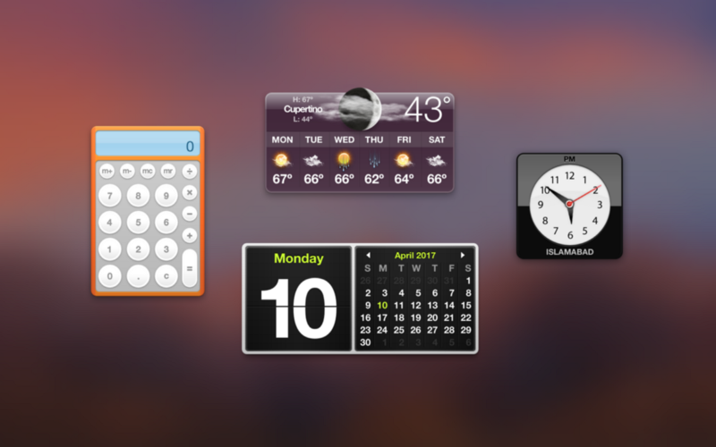
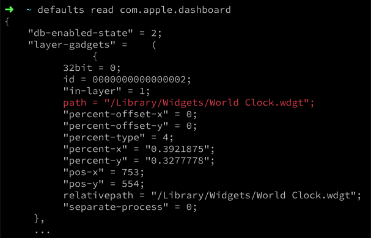

---
layout:	post
title:	"X Site eScape (Part I): Exploitation of An Old CoreFoundation Sandbox Bug"
date:	2020-05-28
image:  img/2020-05-28-x-site-escape-part/banner.webp
desc:   Triggering inter-process XSS for fun and profit.
---

What is your impression of XSS? Stealing credentials from websites? Struggling for CSP and SameSite cookies?

Here's an odd case for it. The input vector has nothing to do with the HTTP protocol, and the motivation is to escape the sandbox instead of exfiltrating sensitive tokens. It's a story about how I turned a sandbox escape primitive to a XSS in a privileged WebView and archive further native code execution.

Last year I blogged about a TOCTOU bug that doesn't require race. It seemed to be long standing since OS X Yosemite or even earlier, definitely before I've ever had my very first Mac.

I wrote the root cause of the bug before. The one-liner PoC writes a launch entry that can be activated upon the next login, which is enough for both sandbox escape and persistence. But is there a way to trigger the code execution immediately? Surely yes. Messing up with an arbitrary property list file is a powerful primitive. Here I picked Dashboard as my target.

> Dashboard was an application for Apple Inc.'s macOS operating systems, used as a secondary desktop for hosting mini-applications known as widgets.
>
> 

Dashboard uses WebView (distinguished from [WKWebView](https://developer.apple.com/documentation/webkit/wkwebview)) to render the page, so there is no JIT nor sandbox. A non-jit bug is required to archive code execution outside. There came a weird idea in my head: any possibility that I can do XSS in Dashboard?


At first, I was looking at the WebClip of Safari. There used to be a context menu in Safari that can add the current page to Dashboard. I thought that there might be some way to trigger the action through Safari IPC. After analyzing its workflow, I just gave it up because it requires user interaction to take place in the UIProcess.


Now, plan B is to abuse writing plist to install a user-defined widget. A widget is a piece of HTML application that has a .wdgt extension. Each bundle consists of at least the following contents:

* Info.plist: the manifest
* An HTML
* An icon in png format
* Other assets like stylesheets and external scripts

macOS used to have preinstalled widgets in `/Library/Widgets`, and `~/Library/Widgets` is for 3rd-party widgets. The historical widget market is still on Apple's official site now!

[](https://web.archive.org/web/20190617220724/https://www.apple.com/downloads/dashboard/)

For further information about widgets, there is a book named [*Beginning Mac OS X Tiger Dashboard Widget Development.*](https://books.google.com.hk/books?id=8VH2FdsBO_UC)

There is a preferences domain that holds the active layout of all widgets. You see the key path is absolute, which means we can add widgets without touching the recommended locations.



To trigger an XSS in Dashboard, drop the bundle somewhere writable and register it using the TOCTOU bug in *cfprefsd*. As mentioned before we have to release a well-organized bundle. The manifest file Info.plist and here are some of its essential entries:

* CFBundleDisplayName and CFBundleIdentifier: the name and identifier
* MainHTML: name of the main user interface
* AllowNetworkAccess: permission to make cross-domain AJAX
* AllowSystem: permission to execute a shell command
* AllowJava: permission to use Java
* AllowFullAccess: permission to read local files
Holy crap! Did you see the phase 'shell command'? It implies that once we had a custom widget, there is no need for re-exploiting the renderer twice.

This is the implementation of the WebView's delegate:

> /System/Library/PrivateFrameworks/DashboardClient.framework/DashboardClient

Some Objective C objects are bridged to the javascript:

```
➜ ~ nm /System/Library/PrivateFrameworks/DashboardClient.framework/DashboardClient | grep webScriptNameForSelector
0000000000007c5b t +[DBCAsyncUNIXScriptJSObject webScriptNameForSelector:]
000000000000540b t +[DBCCalculatorJSObject webScriptNameForSelector:]
0000000000005b93 t +[DBCJSObject webScriptNameForSelector:]
0000000000005fac t +[DBCMenuJSObject webScriptNameForSelector:]
00000000000060e4 t +[DBCScriptingJSObject webScriptNameForSelector:]
0000000000006bbf t +[DBCUNIXScriptJSObject webScriptNameForSelector:]
```

The class `DBCScriptingJSObject` exposes an API to the window object, which calls `+[DBCUNIXScriptJSObject UNIXScriptWithCommand:callback:currentDirectory:widget:]` to execute shell command internally. This is it.


```html
<h1 class="breathe">Pwned by AntFin LightYear</h1>
<script type='text/javascript'>
    window.onload = function () {
        widget.onshow = function () {
            widget.system('/usr/bin/open -a Calculator');
            // widget.system('/usr/bin/killall -9 Safari');
            // widget.system('/usr/bin/defaults write com.apple.dashboard mcx-disabled -boolean YES');
        }
    }
</script>
```

Guess it's born to be misused.

There are still two things left. What if Dashboard is disabled? And the widget needs to be activated to trigger command execution.

Now it's time for miracles. It just happened to be a MIG service named `com.apple.dock.server` that controls the preferences of Dock and Dashboard, and it even allows access from renderer sandbox. It's even got some neat private APIs so you don't have to build Mach message on your own.

```
➜ ~ nm /System/Library/Frameworks/ApplicationServices.framework/Frameworks/HIServices.framework/HIServices | grep CoreDock | grep \ T\
0000000000019e51 T _CoreDockAddFileToDock
0000000000018dad T _CoreDockBounceAppTile
0000000000018df2 T _CoreDockCompositeProcessImage
0000000000011e62 T _CoreDockCopyPreferences
000000000001a410 T _CoreDockCopyWorkspacesAppBindings
...
```

It doesn't matter whether Dashboard is on or not. We can always use `CoreDockSetPreferences`.


`CoreDockSendNotification` accepts a string to toggle corresponding desktop actions:

* LaunchPad: `com.apple.launchpad.toggle`
* Show desktop: `com.apple.showdesktop.awake`
* Show Workspaces: `com.apple.workspaces.awake`
* Exposé: `com.apple.expose.awake` / `com.apple.expose.front.awake`
* Show Dashboard: `com.apple.dashboard.awake`
* TouchPad Preferences: `com.apple.dashboard.touchbar.preference`

Now it goes like this.

1. Renderer takeover
2. Safari renderer sandbox has a writable temporary directory, where we can release a widget bundle here. Dashboard does not care about the quarantine flag
3. Manipulate the preferences domain `com.apple.dashboard` to install our widget
4. `CoreDockSetPreferences` to enable Dashboard forcibly
5. `CoreDockSendNotification` to activate Dashboard desktop
6. Widget activated and game over

As you see, this exploit is just full of coincidence.

The source code can be found here (and you can see how dumb it is):

<https://github.com/ChiChou/sploits/tree/main/macOS/up-to-10.13.6-sbx>
