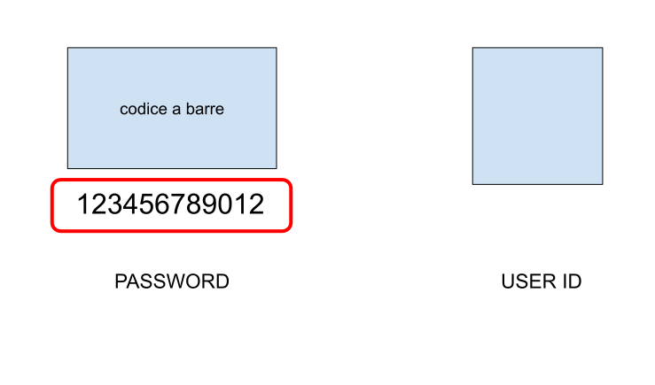

L'Italia è fantastica per i turisti. Ma per vivere qui, è una storia diversa.

I studenti e i lavoratori hanno spesso sperimentato il dolore di dover aspettare il rinnovo del permesso di soggiorno.

C'è un RSS per controllare lo stato del rinnovo, anche se non accelera nulla.

Per fortuna, il website ufficiale del Ministero dell'Interno ha un RSS per il permesso di soggiorno, che è molto utile per tenere traccia dello stato.

Devi usare il password sopra la ricevuta, che è un codice numerico lungo 12 caratteri.



Per esempio, se il tuo codice è `123456789012`, l'URL RSS sarà:

> https://questure.poliziadistato.it/servizio/stranieri?lang=english&pratica=123456789012&invia=Submit&mime=4

C'è un problema, però. Il sito web non è molto amichevole con i client RSS, e non fornisce un output valido.
Ho scritto un proxy per normalizzare l'output e renderlo più facile da usare.

```js
/**
 * Welcome to Cloudflare Workers! This is your first worker.
 *
 * - Run "npm run dev" in your terminal to start a development server
 * - Open a browser tab at http://localhost:8787/ to see your worker in action
 * - Run "npm run deploy" to publish your worker
 *
 * Learn more at https://developers.cloudflare.com/workers/
 */

async function get(pass) {
  const OPEN_TAG = "<![CDATA[";
  const CLOSE_TAG = "]]>";

  const url = `https://questure.poliziadistato.it/servizio/stranieri?lang=english&pratica=${pass}&invia=Submit&mime=4`;
  const response = await fetch(url);
  if (!response.ok) {
    throw new Error(`${response.status} ${response.statusText}`);
  }

  const text = await response.text();
  const start = text.indexOf(OPEN_TAG);
  const end = text.indexOf(CLOSE_TAG, start);

  if (start !== -1 && end !== -1)
    return text.substring(start + OPEN_TAG.length, end);

  throw new Error("Invalid response format");
}

export default {
  async fetch(request, env, ctx) {
    const url = new URL(request.url);

    if (url.pathname !== "/proxy")
      return new Response("Not Found", { status: 404 });

    const pass = url.searchParams.get("pass");
    if (!pass)
      return new Response("Password can not be empty", { status: 400 });

    try {
      const msg = await get(pass);
      return new Response(msg, {
        headers: { "Content-Type": "text/plain" },
      });
    } catch (error) {
      return new Response(`Error: ${error.message}`, { status: 500 });
    }
  },
};
```

Allora puoi usare questo proxy sul iOS Shortcuts per creare un bot che ti dice il stato ogni giorno.
